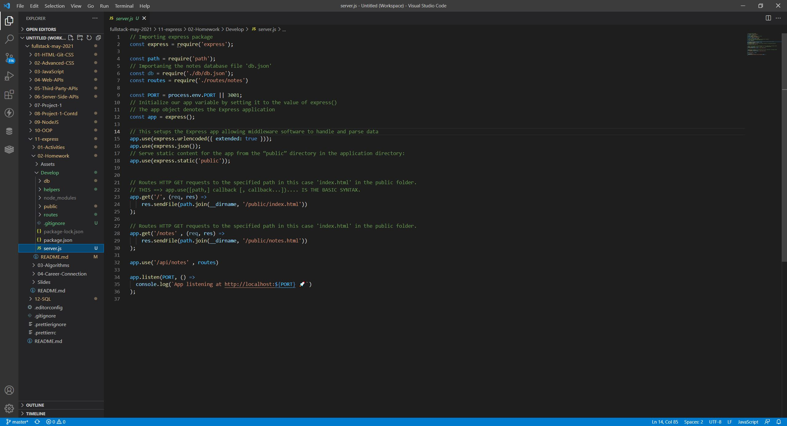
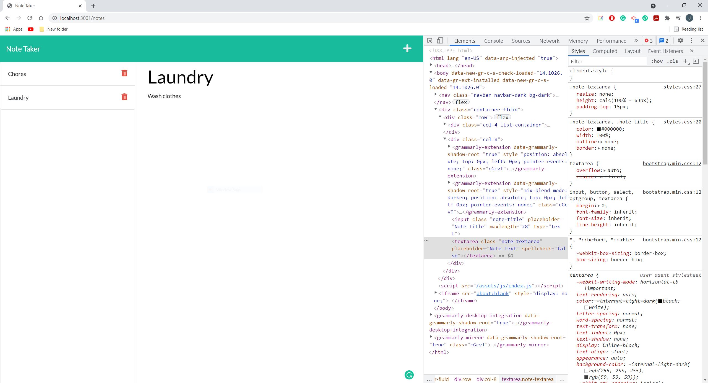
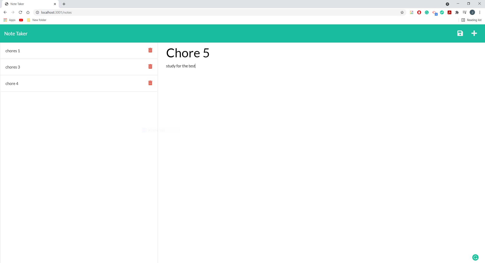

## Project Title: Note Taker App

  ## Description:
  The application allows users to write down notes for anything such as chores or appoitments or anything one could think of that requires reminding. Users can make and store as many notes as they can. With the opition to delete made notes, you can make and delete as many as you want. Forget what you were suppose to do, this Note Taking app is the application for you.

  ## Table of Contents
  * [Installation](#installation)
  * [Usage](#usage)
  * [Contributors](#contributors)
  * [License](#license)
  * [Tests](#tests)
  * [Questions](#questions)
  

  ## Installation
  -- What technologies did the application require in order to run smoothly and effectively?--

  The technology used in this application include Javascript, CSS, HTML, Node, Express and various other npm packages.

  ## Usage
  -- What is the application used for? --

  This application does not have a dedicated group of individuals. Instead anyone can use this application. Not can web developers can used the application to record different notes or patches to make, other people individuals can use this as a way to sort ideas or keep track of any type of appointments or notes they want to make for themselves. The application will be able to record new notes and display them on the left column of the application where they can be accessed if needed. These notes can also be deleted when the delete button is pressed. Overall, a useful application for the busy everyday worker.

## Deployed Link

https://pgpguru.github.io/fictional-fiesta/

  ## License
  -- Are there any license the application has? --

  This Application is covered by the MIT license.

  [License Information](https://opensource.org/licenses/MIT)

  

  ## Tests
  -- How can we test the application --

  This application can be tested through visual code studios. 
    -Before the file can be ran, make sure that Node and Express is installed. These can be installed by running 'npm install' or 'npm i' in the command line. 
    -Once both are installed, run the application by running the server.js file in node in the command line in VS through 'node server.js'
    -A link will generate which should take your to a application running on github

  ## Demonstration
  -- Simple Demonstration --
  .gif)

  ## Screenshots/Pictures
  -- Basic Code for application --
  

  -- Application Running in Browser --
  

  -- Final Application --
  

  ## Live Links

  